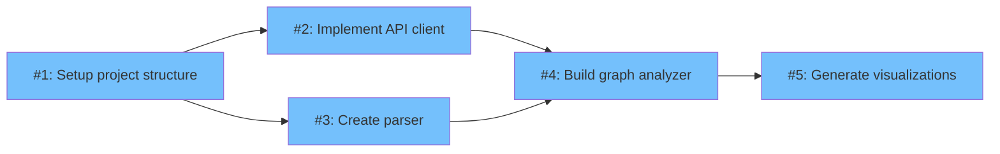

# GitHub Issue Dependency Visualizer

A powerful library to visualize dependencies between GitHub Issues, making it easy to identify critical paths and support task prioritization decisions.

[](https://opensource.org/licenses/MIT)
[](https://www.typescriptlang.org/)

## Features

- 🔍 **Native GitHub Integration**: Uses GitHub REST API for sub-issues and dependencies
- 🔄 **Cycle Detection**: Detects circular dependencies in your issue graph
- 🎨 **Multiple Visualizations**: Generate Mermaid diagrams or interactive HTML visualizations
- 🎯 **Advanced Filtering**: Filter by labels, assignees, dates, or GitHub Search queries
- 🚀 **Fast & Efficient**: Process hundreds of issues in seconds
- 💻 **CLI & Library**: Use as a command-line tool or integrate into your workflow

## Installation

```bash
npm install -g github-issue-dependency-visualizer
```

Or use directly with npx:

```bash
npx github-issue-dependency-visualizer visualize owner/repo
```

## Quick Start

### CLI Usage

```bash
# Basic usage
github-issue-deps visualize owner/repo --token YOUR_GITHUB_TOKEN

# Generate interactive HTML
github-issue-deps visualize owner/repo \
  --format interactive \
  --output ./graph.html

# Filter by labels
github-issue-deps visualize owner/repo \
  --label "priority:high" \
  --label "bug"

# Use GitHub Search query for advanced filtering
github-issue-deps visualize owner/repo \
  --query "is:blocked label:bug"
```

### Library Usage

```typescript
import { IssueDependencyVisualizer } from 'github-issue-dependency-visualizer';

const visualizer = new IssueDependencyVisualizer(process.env.GITHUB_TOKEN!);

// Generate dependency graph
const graph = await visualizer.generateGraph('owner/repo');

// Generate Mermaid diagram
const mermaid = visualizer.generateVisualization(graph, 'mermaid');
console.log(mermaid);

// Show metrics
console.log(`Total Issues: ${graph.metrics.totalIssues}`);
console.log(`Total Dependencies: ${graph.metrics.totalDependencies}`);
```

## How It Works

### Dependency Types

The visualizer supports two types of dependencies:

1. **Blocked-by**: Issues that must be completed before the current issue can start
   - Detected via GitHub's native dependencies API

2. **Sub-issues**: Issues that are part of completing a larger issue
   - Detected via GitHub's native sub-issues API

### Dependency Detection

Dependencies are detected through GitHub's Native REST API:

1. **Sub-issues API**: `/repos/{owner}/{repo}/issues/{issue_number}/sub_issues`
2. **Parent issues API**: `/repos/{owner}/{repo}/issues/{issue_number}/parent`
3. **Dependencies API**: `/repos/{owner}/{repo}/issues/{issue_number}/dependencies/blocked_by`
4. **Blocking API**: `/repos/{owner}/{repo}/issues/{issue_number}/dependencies/blocking`

### Cycle Detection

The analyzer detects circular dependencies using depth-first search:

1. **DFS Traversal**: Visit all nodes in the dependency graph
2. **Recursion Stack**: Track nodes currently being explored
3. **Cycle Detection**: If a node in the recursion stack is revisited, a cycle exists
4. **Error Reporting**: Throws detailed error with the cycle path

## CLI Reference

### `visualize` Command

Generate a visual dependency graph.

```bash
github-issue-deps visualize <repository> [options]
```

**Options:**

- `-t, --token <token>`: GitHub personal access token (or use `GITHUB_TOKEN` env var)
- `-f, --format <format>`: Output format: `mermaid` or `interactive` (default: mermaid)
- `-o, --output <path>`: Save to file instead of printing to console
- `-l, --label <labels...>`: Filter by labels (can specify multiple)
- `-a, --assignee <assignees...>`: Filter by assignees
- `-s, --state <state>`: Filter by state: `open`, `closed`, or `all` (default: open)
- `-q, --query <query>`: GitHub Search query (uses Search API when specified)
- `--search <text>`: Search text in title or body
- `--created-since <date>`: Filter issues created since date (ISO 8601 format)
- `--created-until <date>`: Filter issues created until date (ISO 8601 format)
- `--updated-since <date>`: Filter issues updated since date (ISO 8601 format)
- `--updated-until <date>`: Filter issues updated until date (ISO 8601 format)

**Examples:**

```bash
# Save Mermaid diagram to file
github-issue-deps visualize facebook/react \
  --output ./react-deps.md

# Generate interactive visualization
github-issue-deps visualize vuejs/vue \
  --format interactive \
  --output ./vue-deps.html

# Filter by label and assignee
github-issue-deps visualize microsoft/vscode \
  --label "bug" \
  --assignee "@me"

# Use GitHub Search query
github-issue-deps visualize owner/repo \
  --query "is:open is:blocked label:feature"

# Filter by date range
github-issue-deps visualize owner/repo \
  --created-since 2025-01-01 \
  --state all
```

## Library API

### `IssueDependencyVisualizer`

Main class for generating visualizations.

```typescript
class IssueDependencyVisualizer {
  constructor(githubToken: string);

  async generateGraph(
    repository: string | RepositoryInfo,
    options?: Partial<VisualizationOptions>
  ): Promise<DependencyGraph>;

  generateVisualization(
    graph: DependencyGraph,
    format: 'mermaid' | 'interactive'
  ): string;

  generateMetricsSummary(graph: DependencyGraph): string;
}
```

### Helper Function

```typescript
async function visualizeRepository(
  repository: string,
  githubToken: string,
  options?: Partial<VisualizationOptions>
): Promise<{
  graph: DependencyGraph;
  visualization: string;
  metrics: string;
}>;
```

**Example:**

```typescript
import { visualizeRepository } from 'github-issue-dependency-visualizer';

const result = await visualizeRepository(
  'facebook/react',
  process.env.GITHUB_TOKEN!,
  {
    format: 'mermaid',
    filters: {
      labels: ['good first issue'],
      state: 'open',
    },
  }
);

console.log(result.metrics);
console.log(result.visualization);
```

## Configuration

### Environment Variables

Create a `.env` file:

```env
GITHUB_TOKEN=ghp_your_token_here
```

### GitHub Token Permissions

Your token needs the following scopes:

- `repo` (for private repositories)
- `public_repo` (for public repositories only)

Generate a token at: https://github.com/settings/tokens

## Output Examples

### Mermaid Diagram



### Metrics Summary

```
## Dependency Graph Metrics

- **Total Issues**: 15
- **Total Dependencies**: 23
```

## Architecture

```
src/
├── api/
│   ├── github-client.ts    # GitHub API wrapper
│   └── types.ts            # Type definitions
├── parser/
│   ├── dependency-parser.ts # Dependency parser (unused)
│   └── patterns.ts          # Pattern definitions
├── graph/
│   ├── builder.ts          # Build dependency graph
│   ├── analyzer.ts         # Cycle detection
│   └── types.ts            # Graph types
├── visualizer/
│   ├── mermaid.ts          # Mermaid generator
│   ├── interactive.ts      # HTML/Cytoscape generator
│   └── formatter.ts        # Formatting utilities
├── cli/
│   └── index.ts            # CLI interface
└── index.ts                # Main library exports
```

## Development

### Setup

```bash
# Clone the repository
git clone https://github.com/yourusername/github-issue-visualizer.git
cd github-issue-visualizer

# Install dependencies
npm install

# Build
npm run build

# Run tests
npm test

# Run tests with coverage
npm run test:coverage
```

### Testing

```bash
# Run all tests
npm test

# Watch mode
npm run test:watch

# Coverage report
npm run test:coverage
```

### Linting

```bash
npm run lint
```

## Troubleshooting

### "Cannot access repository" error

- Verify your GitHub token has the correct permissions
- Check if the repository exists and you have access
- Ensure token is set via `--token` flag or `GITHUB_TOKEN` env var

### "Circular dependency detected" error

This means your issues have a dependency loop. Review the reported cycle and update issue dependencies to break the loop.

### Rate limiting

GitHub API has rate limits (5000 requests/hour for authenticated users). The library uses GraphQL to minimize requests, but for very large repositories, you may hit limits.

## Contributing

Contributions are welcome! Please:

1. Fork the repository
2. Create a feature branch (`git checkout -b feature/amazing-feature`)
3. Commit your changes (`git commit -m 'Add amazing feature'`)
4. Push to the branch (`git push origin feature/amazing-feature`)
5. Open a Pull Request

## License

MIT License - see [LICENSE](LICENSE) file for details.

## Acknowledgments

- Built with [Octokit](https://github.com/octokit/octokit.js) for GitHub API
- Visualizations powered by [Mermaid.js](https://mermaid.js.org/) and [Cytoscape.js](https://js.cytoscape.org/)
- CLI built with [Commander.js](https://github.com/tj/commander.js)

## Roadmap

- [ ] GraphQL API migration for improved performance
- [ ] Critical path analysis and bottleneck detection
- [ ] Node coloring based on criticality
- [ ] Optional text parsing fallback for legacy issues
- [ ] Cross-repository dependencies
- [ ] GitHub Action integration
- [ ] Real-time updates via webhooks
- [ ] Project board integration
- [ ] Time-based analysis (due dates)
- [ ] Export to PNG/SVG
- [ ] Assignee workload visualization

## Support

- 📫 [Open an issue](https://github.com/yourusername/github-issue-visualizer/issues)
- 💬 [Discussions](https://github.com/yourusername/github-issue-visualizer/discussions)

---

**Made with ❤️ for better project management**
