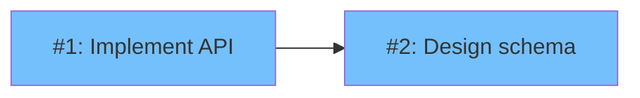
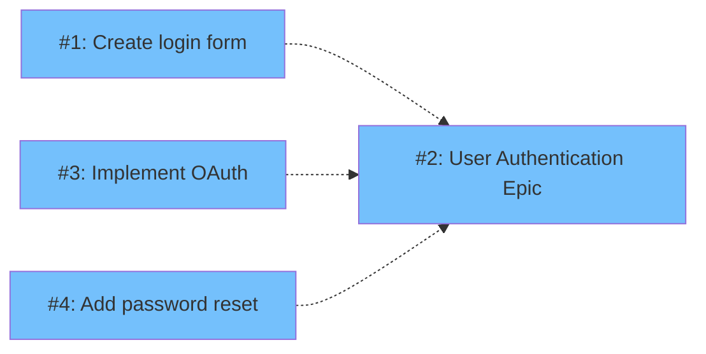
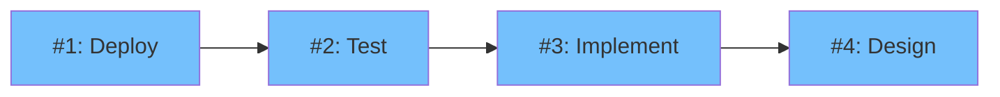
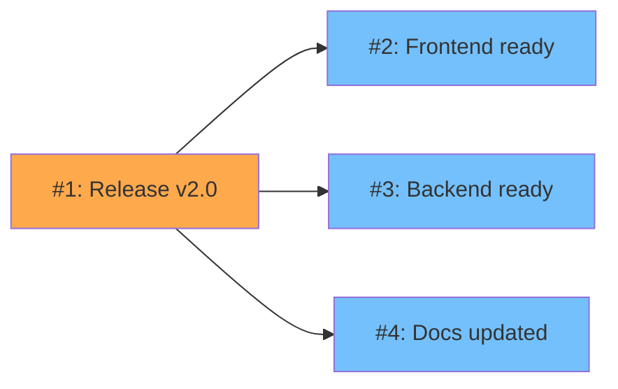
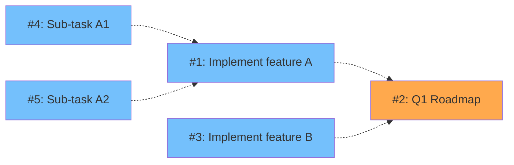
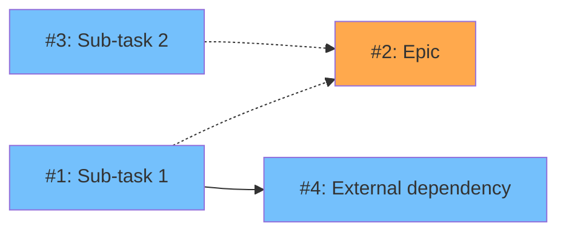
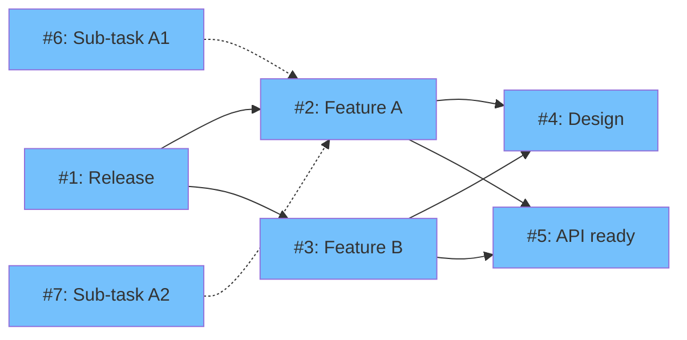

# GitHub Issue Relationships - Complete Guide

## Overview

GitHub provides several ways to express relationships between issues. This document describes the supported relationship types, their visualization patterns, and implementation details in the GitHub Issue Dependency Visualizer.

## Relationship Types

### 1. Blocked-by / Blocking (Dependencies)

**Description**: Expresses that one issue cannot start until another issue is completed.

**Direction**: Unidirectional (A is blocked-by B means A depends on B)

**GitHub API Support**:
- ✅ REST API (primary): `/repos/{owner}/{repo}/issues/{issue_number}/dependencies/blocked_by`, `/repos/{owner}/{repo}/issues/{issue_number}/dependencies/blocking`
- ✅ GraphQL API (future): mutations `addBlockedBy`, `removeBlockedBy`
- ✅ Search filters: `is:blocked`, `is:blocking`, `blocked-by:`, `blocking:`

**Text Patterns** (scoped out):
```
Note: Text parsing has been scoped out to ensure data consistency.
Users must use GitHub's native blocked-by feature via the web UI or API.
```

**Visualization**:
- **Mermaid**: Solid arrow `-->`
- **Cytoscape**: Solid line, color `#666`

**Example**:



In this example:
- Issue #1 is **blocked-by** Issue #2
- Issue #2 must be completed before Issue #1 can start

### 2. Sub-issue / Parent (Hierarchical)

**Description**: Expresses parent-child relationship where sub-issues are parts of completing the parent.

**Direction**: Unidirectional (child → parent)

**GitHub API Support**:
- ✅ REST API (primary): `/repos/{owner}/{repo}/issues/{issue_number}/sub_issues`, `/repos/{owner}/{repo}/issues/{issue_number}/parent`
- ✅ GraphQL API (future): fields `trackedIssues` (parents), `trackedInIssues` (children), mutations `addSubIssue`, `removeSubIssue`
- ⚠️ Limitations: Max 100 sub-issues, 8 nesting levels

**Text Patterns** (scoped out):
```
Note: Text parsing has been scoped out to ensure data consistency.
Users must use GitHub's native sub-issues feature via the web UI or API.
```

**Visualization**:
- **Mermaid**: Dashed arrow `-.->`
- **Cytoscape**: Dashed line, color `#999`

**Example**:



In this example:
- Issues #1, #3, #4 are **sub-issues** of Epic #2
- Epic #2 requires completion of all sub-issues

### 3. Task Lists (Checklist)

**Description**: Markdown checklists within issue body can reference other issues.

**GitHub API Support**:
- ❌ No dedicated API
- ✅ Detected via text parsing

**Format**:
```markdown
- [ ] #123 Complete design
- [x] #124 Setup infrastructure
```

**Implementation**: Treated as `sub-issue` relationships in this library.

## Visualization Patterns

### Pattern 1: Simple Blocked-by Chain



**Interpretation**:
- #4 (Design) must be done first
- Then #3 (Implement)
- Then #2 (Test)
- Finally #1 (Deploy)

**Depth calculation**:
- #4: depth 0 (leaf)
- #3: depth 1
- #2: depth 2
- #1: depth 3

### Pattern 2: Multiple Dependencies



**Interpretation**:
- Issue #1 is blocked by #2, #3, and #4
- All must be completed before #1 can start
- #1 has **high criticality** (orange) because it has multiple dependencies

### Pattern 3: Hierarchical Epic Structure



**Interpretation**:
- Epic #2 contains features #1 and #3
- Feature #1 contains sub-tasks #4 and #5
- Maximum nesting: 2 levels

### Pattern 4: Mixed Relationships (Blocked-by + Sub-issue)



**Interpretation**:
- #1 and #3 are sub-issues of Epic #2
- #1 is also blocked by external dependency #4
- #4 must be resolved before #1, which must be completed before Epic #2

**Depth calculation**:
```
depth(#4) = 0
depth(#1) = max(
  depth(#4) + 1,  // blocked-by #4
  0               // no parent depth
) = 1
depth(#3) = 0
depth(#2) = max(
  depth(#1) + 1,  // parent of #1
  depth(#3) + 1   // parent of #3
) = 2
```

### Pattern 5: Complex Dependency Graph



**Interpretation**:
- #1 (Release) is blocked by Features A and B
- Both Features #2 and #3 depend on #4 (Design) and #5 (API ready)
- Sub-issues #6, #7 contribute to Feature A (#2)

## Implementation Details

### Data Sources

This library uses **GitHub's Native REST API** for relationship extraction:

#### Native GitHub REST API

**REST Endpoints**:
```typescript
// Sub-issues
GET /repos/{owner}/{repo}/issues/{issue_number}/sub_issues
GET /repos/{owner}/{repo}/issues/{issue_number}/parent

// Dependencies
GET /repos/{owner}/{repo}/issues/{issue_number}/dependencies/blocked_by
GET /repos/{owner}/{repo}/issues/{issue_number}/dependencies/blocking
```

**Advantages**:
- Authoritative source of truth
- No parsing ambiguity
- Automatically maintained by GitHub
- Full support for both sub-issues and dependencies

**Current Support**: ✅ Full support via REST API

#### Future Migration to GraphQL

GraphQL support is planned for future implementation to improve performance:

```graphql
issue {
  trackedIssues(first: 50) {     # Parent issues
    nodes { number }
  }
  trackedInIssues(first: 50) {   # Child issues
    nodes { number }
  }
}
```

**Note**: GraphQL fields for `blockedByIssues` and `blockingIssues` are not yet available in the public API.

#### Text Parsing (Scoped Out)

Text parsing has been **scoped out** to ensure data consistency and reliability:

**Rationale**:
- Eliminates parsing ambiguity
- Forces users to follow GitHub's standard features
- Ensures relationships are properly tracked in GitHub's system
- Simplifies maintenance and testing

**Future**: May be re-enabled as an optional fallback for legacy issues

### Edge Visualization

| Relationship Type | Mermaid | Cytoscape Line Style | Cytoscape Color |
|------------------|---------|---------------------|-----------------|
| Blocked-by | `-->` (solid) | `solid` | `#666` (dark gray) |
| Sub-issue | `-.->` (dashed) | `dashed` | `#999` (light gray) |

### Node Coloring

All nodes are currently colored in blue (`#74c0fc`). Future enhancements may include criticality-based coloring.

## Usage Examples

### CLI Usage

```bash
# Visualize all dependencies
github-issue-viz visualize owner/repo --token $GITHUB_TOKEN

# Filter by labels
github-issue-viz visualize owner/repo --label "sprint-1" --label "feature"

# Use GitHub Search query
github-issue-viz visualize owner/repo --query "is:blocked label:feature"

# Generate interactive HTML
github-issue-viz visualize owner/repo -f interactive -o graph.html
```

### Programmatic Usage

```typescript
import { IssueDependencyVisualizer } from 'github-issue-dependency-visualizer';

const visualizer = new IssueDependencyVisualizer(process.env.GITHUB_TOKEN!);

const graph = await visualizer.generateGraph('owner/repo', {
  filters: {
    state: 'open',
    labels: ['feature'],
  },
});

// Generate Mermaid diagram
const mermaid = visualizer.generateVisualization(graph, 'mermaid');
console.log(mermaid);

// Get metrics
console.log(`Total Issues: ${graph.metrics.totalIssues}`);
console.log(`Total Dependencies: ${graph.metrics.totalDependencies}`);
```

## Filtering Options

### API-Level Filters

Applied during GitHub API query:

```typescript
{
  state: 'open' | 'closed' | 'all',  // Default: 'open'
  labels: ['bug', 'feature'],        // Issues with these labels
  assignees: ['username'],           // Issues assigned to user
  searchText: 'keyword',             // Title or body contains
  createdSince: '2025-01-01',        // ISO 8601 date
  createdUntil: '2025-12-31',        // ISO 8601 date
  updatedSince: '2025-01-01',        // ISO 8601 date
  updatedUntil: '2025-12-31',        // ISO 8601 date
  query: 'is:blocked label:bug',     // GitHub Search query
}
```

### Graph-Level Filters

Applied after building graph:

```typescript
{
  filterLabels: ['sprint-1'],        // Only show these labels
  filterAssignees: ['alice'],        // Only show these assignees
}
```

## Limitations and Future Enhancements

### Current Limitations

❌ **Not Yet Supported**:
1. Critical path analysis (depth calculation, bottleneck detection)
2. Node coloring based on criticality
3. Related-to (weak bidirectional relationships)
4. Duplicates
5. Cross-repository dependencies
6. Multiple parent issues (only first parent tracked)
7. Dependency strength/weight

### Future Enhancements (Priority Order)

**High Priority**:
1. ✅ GitHub REST API integration for sub-issues (COMPLETED)
2. ✅ GitHub REST API integration for dependencies (blocked-by/blocking) (COMPLETED)
3. ✅ GitHub Search API support (COMPLETED)
4. 🔄 Critical path analysis and bottleneck detection
5. 🔄 Node coloring based on criticality scores
6. 🔄 GraphQL migration for improved performance

**Medium Priority**:
7. Optional text parsing fallback for legacy issues
8. Relationship type expansion (`related-to`, `duplicates`)
9. Multiple parent issue support
10. Cross-repository dependency tracking
11. Dependency metadata (strength, confidence level)

**Low Priority**:
12. Bidirectional relationships (related-to)
13. Custom relationship types
14. Temporal dependency analysis

## Cycle Detection

**Behavior**: Cycles in dependencies are **not allowed** and will throw an error.

```typescript
try {
  const graph = await visualizer.generateGraph('owner/repo');
} catch (error) {
  if (error.cycle) {
    console.error('Circular dependency detected:');
    console.error(`Path: ${error.cycle.join(' → ')}`);
  }
}
```

**Example Cycle**:
```
Issue #1 → blocked-by #2
Issue #2 → blocked-by #3
Issue #3 → blocked-by #1  // ❌ Creates cycle
```

**Error Message**: `"Circular dependency detected: 1 -> 2 -> 3 -> 1"`

## API Coverage Summary

| Feature | REST API (Current) | GraphQL (Future) | Text Parse (Scoped Out) | Support |
|---------|-------------------|------------------|------------------------|---------|
| Blocked-by | ✅ | 🔄 Planned | ❌ | ✅ REST API |
| Blocking | ✅ | 🔄 Planned | ❌ | ✅ REST API |
| Sub-issues | ✅ | 🔄 Planned | ❌ | ✅ REST API |
| Parent issues | ✅ | 🔄 Planned | ❌ | ✅ REST API |
| Task lists | ❌ | ❌ | ❌ | ❌ Not supported |
| Related-to | ❌ | ❌ | ❌ | ❌ Not supported |
| Duplicates | ❌ | ❌ | ❌ | ❌ Not supported |

**Notes**:
- ✅ **REST API**: Primary method, fully implemented
- 🔄 **GraphQL**: Planned for future migration to improve performance
- ❌ **Text Parse**: Scoped out to ensure data consistency

## References

- [GitHub Issue Dependencies (General Availability)](https://github.blog/changelog/2025-08-21-issue-dependencies-general-availability/)
- [GitHub Sub-Issues (General Availability)](https://github.blog/changelog/2025-01-06-sub-issues-general-availability/)
- [GitHub GraphQL API Documentation](https://docs.github.com/en/graphql)
- [Mermaid Diagram Syntax](https://mermaid.js.org/syntax/flowchart.html)
- [Cytoscape.js Documentation](https://js.cytoscape.org/)
