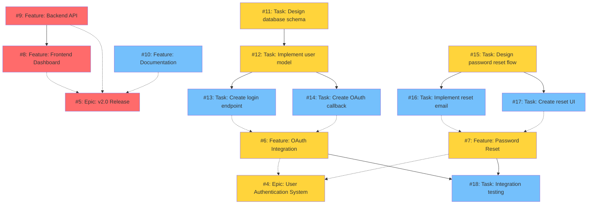
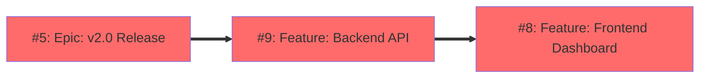

# Sample Issues for Demonstration

This repository contains sample issues that demonstrate various relationship patterns described in the [Issue Relationships Guide](./issue-relationships.md).

## Overview

**Scenario**: Web Application v2.0 Release Project

The sample issues represent a realistic software project with:
- 2 Epic-level issues
- 5 Feature-level issues
- 8 Task-level issues
- **17 total dependencies** (mix of blocked-by and sub-issue relationships)

## Issue Structure

### Epic Issues

#### [#4: Epic: User Authentication System](https://github.com/krhrtky/github-issue-visualizer/issues/4)
Complete user authentication system including OAuth and password management.

**Relationships** (via GitHub native features):
- Has sub-issues: #6, #7

#### [#5: Epic: v2.0 Release](https://github.com/krhrtky/github-issue-visualizer/issues/5)
Major release including authentication system, frontend dashboard, backend API, and documentation.

**Relationships** (via GitHub native features):
- Has sub-issues: #4, #8, #9, #10

### Feature Issues

#### [#6: Feature: OAuth Integration](https://github.com/krhrtky/github-issue-visualizer/issues/6)
Implement OAuth 2.0 authentication flow with support for major providers.

**Relationships** (via GitHub native features):
- Parent issue: #4
- Has sub-issues: #13, #14
- Blocks: #18

#### [#7: Feature: Password Reset](https://github.com/krhrtky/github-issue-visualizer/issues/7)
Implement password reset functionality with email verification.

**Relationships** (via GitHub native features):
- Parent issue: #4
- Has sub-issues: #16, #17
- Blocks: #18

#### [#8: Feature: Frontend Dashboard](https://github.com/krhrtky/github-issue-visualizer/issues/8)
Build user dashboard with React.

**Relationships** (via GitHub native features):
- Parent issue: #5
- Blocked by: #9

#### [#9: Feature: Backend API](https://github.com/krhrtky/github-issue-visualizer/issues/9)
Build REST API with Node.js/Express.

**Relationships** (via GitHub native features):
- Parent issue: #5
- Blocks: #8

#### [#10: Feature: Documentation](https://github.com/krhrtky/github-issue-visualizer/issues/10)
Write comprehensive user and developer documentation.

**Relationships** (via GitHub native features):
- Parent issue: #5

### Task Issues

#### [#11: Task: Design database schema](https://github.com/krhrtky/github-issue-visualizer/issues/11)
Design database schema for user authentication.

**Relationships** (via GitHub native features):
- Blocks: #12

#### [#12: Task: Implement user model](https://github.com/krhrtky/github-issue-visualizer/issues/12)
Create User model with validation and database integration.

**Relationships** (via GitHub native features):
- Blocked by: #11
- Blocks: #13, #14

#### [#13: Task: Create login endpoint](https://github.com/krhrtky/github-issue-visualizer/issues/13)
Implement POST /api/auth/login endpoint.

**Relationships** (via GitHub native features):
- Parent issue: #6
- Blocked by: #12

#### [#14: Task: Create OAuth callback](https://github.com/krhrtky/github-issue-visualizer/issues/14)
Implement OAuth 2.0 callback handler.

**Relationships** (via GitHub native features):
- Parent issue: #6
- Blocked by: #12

#### [#15: Task: Design password reset flow](https://github.com/krhrtky/github-issue-visualizer/issues/15)
Design user flow and security requirements for password reset.

**Relationships** (via GitHub native features):
- Blocks: #16, #17

#### [#16: Task: Implement reset email](https://github.com/krhrtky/github-issue-visualizer/issues/16)
Implement email sending functionality for password reset.

**Relationships** (via GitHub native features):
- Parent issue: #7
- Blocked by: #15

#### [#17: Task: Create reset UI](https://github.com/krhrtky/github-issue-visualizer/issues/17)
Build password reset user interface.

**Relationships** (via GitHub native features):
- Parent issue: #7
- Blocked by: #15

#### [#18: Task: Integration testing](https://github.com/krhrtky/github-issue-visualizer/issues/18)
Run comprehensive integration tests for authentication system.

**Relationships** (via GitHub native features):
- Blocked by: #6, #7

## Dependency Graph Visualization

### Complete Dependency Graph

The following Mermaid diagram shows all 15 issues and their 17 dependencies:



**Legend**:
- **Solid arrows** (`-->`): Blocked-by dependencies (e.g., #12 → #13 means #13 is blocked by #12)
- **Dashed arrows** (`-.->`)): Sub-issue relationships (e.g., #6 -.-> #4 means #6 is a sub-issue of #4)
- **Red nodes** (🔴): On critical path
- **Yellow nodes** (🟡): Medium criticality (2-4 dependents)
- **Blue nodes** (🔵): Low criticality (0-1 dependents)

### Critical Path

The **critical path** represents the longest chain of dependencies. Any delay in these issues will delay the entire project.

**Critical Path**: #5 → #9 → #8 (length: 3)



**Interpretation**:
1. **#5 (v2.0 Release)** depends on (is a parent of) **#9 (Backend API)**
2. **#8 (Frontend Dashboard)** depends on **#9 (Backend API)**
3. Therefore: Complete #9 first, then #8, then all sub-issues to finish #5

## Metrics

```
Total Issues:              15
Total Dependencies:        17
Critical Path Length:       3
```

### Bottlenecks (High Criticality)

Issues with the most dependents (blocking the most other issues):

1. **#5: Epic: v2.0 Release** - 3 dependents (sub-issues: #8, #9, #10)
2. **#6: Feature: OAuth Integration** - 3 dependents (#4 as parent, #13, #14 as sub-issues, #18 blocked)
3. **#7: Feature: Password Reset** - 3 dependents (#4 as parent, #16, #17 as sub-issues, #18 blocked)
4. **#4: Epic: User Authentication System** - 2 dependents (#6, #7 as sub-issues)
5. **#12: Task: Implement user model** - 2 dependents (#13, #14 blocked by this)

## Relationship Pattern Examples

This sample issue set demonstrates the following patterns from the [Issue Relationships Guide](./issue-relationships.md):

### Pattern 1: Simple Blocked-by Chain

```
#11 → #12 → #13
```

- #11 (Design DB schema) → #12 (Implement user model) → #13 (Create login endpoint)

### Pattern 2: Multiple Dependencies

```
#18 is blocked by both #6 and #7
```

### Pattern 3: Hierarchical Epic Structure

```
#5 (v2.0 Release)
├─ #4 (User Auth)
│  ├─ #6 (OAuth)
│  │  ├─ #13 (Login endpoint)
│  │  └─ #14 (OAuth callback)
│  └─ #7 (Password Reset)
│     ├─ #16 (Reset email)
│     └─ #17 (Reset UI)
├─ #8 (Frontend)
├─ #9 (Backend)
└─ #10 (Docs)
```

Maximum nesting: 3 levels (Epic → Feature → Task)

### Pattern 4: Mixed Relationships (Blocked-by + Sub-issue)

```
#13 (Task: Create login endpoint)
├─ Parent issue: #6 (OAuth Integration)     [via GitHub sub-issues feature]
└─ Blocked by: #12 (Implement user model)   [via GitHub dependencies feature]
```

Issue #13 has both hierarchical (sub-issue) and sequential (blocked-by) dependencies, all managed through GitHub's native features.

### Pattern 5: Critical Path Visualization

The critical path (#5 → #9 → #8) is highlighted in red in the complete graph.

### Pattern 6: Complex Dependency Graph

The complete graph above shows all patterns combined.

## Running the Visualizer on Sample Issues

### Prerequisites

```bash
# Build the project
npm run build

# Authenticate with GitHub
gh auth login
```

### Basic Visualization

```bash
# Analyze dependencies
node dist/cli/index.js analyze krhrtky/github-issue-visualizer

# Generate Mermaid diagram
node dist/cli/index.js visualize krhrtky/github-issue-visualizer -o graph.md

# Show critical path only
node dist/cli/index.js analyze krhrtky/github-issue-visualizer --show-critical-path
```

### Interactive HTML Visualization

```bash
# Generate interactive Cytoscape.js visualization
node dist/cli/index.js visualize krhrtky/github-issue-visualizer \
  -f interactive \
  -o sample-graph.html

# Open in browser
open sample-graph.html
```

### Programmatic Usage

```typescript
import { IssueDependencyVisualizer } from 'github-issue-dependency-visualizer';

const visualizer = new IssueDependencyVisualizer(process.env.GITHUB_TOKEN!);

const graph = await visualizer.generateGraph('krhrtky/github-issue-visualizer');

console.log(`Total Issues: ${graph.metrics.totalIssues}`);
console.log(`Total Dependencies: ${graph.metrics.totalDependencies}`);
console.log(`Critical Path Length: ${graph.metrics.criticalPathLength}`);

// Generate visualization
const mermaid = visualizer.generateVisualization(graph, 'mermaid', true);
console.log(mermaid);
```

## Notes on Issue Creation

These sample issues were created using GitHub's native relationship features:

### Creating Sub-issues

Use GitHub's native sub-issues feature via the web UI or API:

```bash
# Via GraphQL API (requires authentication)
gh api graphql -f query='
  mutation {
    addSubIssue(input: {
      issueId: "PARENT_ISSUE_NODE_ID"
      subIssueId: "CHILD_ISSUE_NODE_ID"
    }) {
      issue { number }
    }
  }
'
```

Or use the GitHub web UI: Issue page → Development → Convert to sub-issue

### Creating Dependencies (Blocked-by)

Use GitHub's native dependencies feature:

```bash
# Via GraphQL API
gh api graphql -f query='
  mutation {
    addBlockedBy(input: {
      issueId: "BLOCKED_ISSUE_NODE_ID"
      blockingIssueId: "BLOCKING_ISSUE_NODE_ID"
    }) {
      issue { number }
    }
  }
'
```

Or use the GitHub web UI: Issue page → Development → Add blocked by

**Important**:
- This library uses GitHub's **REST API** to fetch relationships
- Text parsing is **scoped out** to ensure data consistency
- All relationships must be created using GitHub's native features

## Expected vs Actual Results

### Expected Behavior ✅

- ✅ 17 dependencies detected from GitHub's native REST API
- ✅ No circular dependencies
- ✅ Critical path correctly calculated
- ✅ Bottlenecks identified
- ✅ Both Mermaid and interactive HTML formats work

### Implementation Details

- ✅ **REST API**: Primary method for fetching relationships
  - Sub-issues: `/repos/{owner}/{repo}/issues/{issue_number}/sub_issues`
  - Parent issues: `/repos/{owner}/{repo}/issues/{issue_number}/parent`
  - Blocked-by: `/repos/{owner}/{repo}/issues/{issue_number}/dependencies/blocked_by`
  - Blocking: `/repos/{owner}/{repo}/issues/{issue_number}/dependencies/blocking`
- ✅ **Data consistency**: All relationships fetched from GitHub's authoritative source
- ❌ **Text parsing**: Scoped out to ensure data reliability

## Updating Sample Issues

To modify the sample issues and re-run the visualizer:

```bash
# Edit an issue
gh issue edit 6 --body "Updated description with new dependencies..."

# Re-run visualizer
node dist/cli/index.js visualize krhrtky/github-issue-visualizer -o graph.md
```

## Cleanup

To remove all sample issues:

```bash
# Close all issues
for i in {4..18}; do
  gh issue close $i --comment "Closing sample issue"
done

# Or delete (requires admin permissions)
# Note: GitHub doesn't support issue deletion via CLI for safety reasons
```
